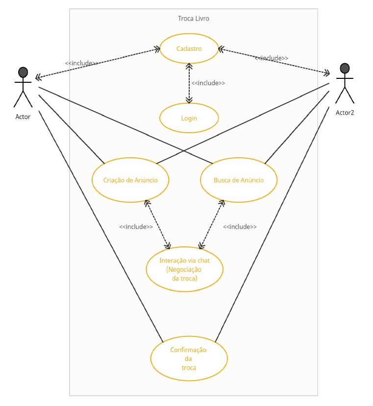

<h1>Conectando Leitores</h1> 

  
  
  
  
  
  
  
  
  
  
  
  
  
  

> Status do Projeto: :heavy_check_mark: (concluido) | :warning: (em desenvolvimento) | :x: (não iniciada)

### Tópicos 

:small_blue_diamond: [Descrição do projeto](#descrição-do-projeto-writing_hand) :heavy_check_mark:

:small_blue_diamond: [Objetivos do projeto](#objetivos-do-projeto-dart) :heavy_check_mark:

:small_blue_diamond: [Funcionalidades](#funcionalidades-video_game) :heavy_check_mark:

:small_blue_diamond: [Casos de Uso](#casos-de-uso-technologist) :heavy_check_mark:

:small_blue_diamond: [Banco de dados](/../../../../Tech-Readers/database) :heavy_check_mark:

:small_blue_diamond: [BackEnd](/../../../../Tech-Readers/backend) :heavy_check_mark:

:small_blue_diamond: [FrontEnd](/../../../../Tech-Readers/frontend) :x:

:small_blue_diamond: [Linguagens, tecnologias, dependências e libs utilizadas](#linguagens-tecnologias-dependências-e-libs-utilizadas-hammer_and_wrench-gear-books)

:small_blue_diamond: [Desenvolvedores/Contribuintes](#desenvolvedorescontribuintes-octocat)

... 

## Descrição do projeto :writing_hand:

  Trata-se de uma aplicação web que facilite a troca de livros entre leitores, promovendo o compartilhamento de recursos literários e a interação social dentro da comunidade de leitores.

## Objetivos do projeto :dart:

**1. Facilitar a Troca de Livros:**

- Permitir que os usuários listem seus livros disponíveis para troca e busquem por títulos desejados, simplificando o processo de encontrar outros leitores interessados em realizar trocas.

**2. Promover a Leitura e Compartilhamento:**

- Incentivar a leitura e o compartilhamento de livros, garantindo que os recursos literários sejam utilizados de maneira eficiente e alcançando um público mais amplo.

**3. Construir uma Comunidade de Leitores:**

- Criar um espaço onde leitores possam interagir, compartilhar experiências literárias e formar conexões significativas com outros apaixonados por leitura.

**4. Aumentar a Confiança e Segurança nas Trocas:**

- Implementar sistemas de avaliação e reputação para aumentar a confiança entre os usuários, garantindo que as trocas sejam realizadas de forma segura e transparente.

**5. Reduzir o Acúmulo de Livros Parados:**

- Oferecer uma solução para o problema de acúmulo de livros parados nas prateleiras, permitindo que livros que já foram lidos por um usuário possam trazer alegria e conhecimento a outros.

**6. Melhorar a Logística de Trocas:**

- Proporcionar ferramentas para organizar e coordenar a logística das trocas, reduzindo a complexidade e aumentando a eficiência do processo.

**7. Oferecer uma Alternativa aos Métodos Informais:**

- Substituir métodos informais e ineficazes de troca de livros, como mensagens esporádicas em grupos de redes sociais, por uma plataforma dedicada e bem projetada.

## Funcionalidades :video_game:

**Cadastro de Usuários:** :warning:
  1. Permitir que os usuários se cadastrem na plataforma com informações básicas (nome, email, senha, telefone, endereço).

**Gerenciamento de Anúncios:** :warning:
  1. Permitir que os usuários adicionem, removam ou atualizem informações de seus livros disponíveis para troca.

**Busca de Anúncios:** :warning:
  1. Possibilitar busca que permita aos usuários procurar anúncios por título, autor e gênero dos livros.

**Gestão de Trocas:** :warning:
  1. Permitir que os usuários enviem propostas de troca para outros usuários com base nos anúncios, especificando quais livros estão oferecendo e quais desejam receber.

**Histórico de Trocas:** :warning:
  1. Registrar todas as trocas realizadas para manter um histórico que pode ser visualizado pelos usuários.

**Sistema de Avaliação e Reputação:** :warning:
  1. Possibilitar um sistema de avaliação onde os usuários possam avaliar suas experiências de troca, contribuindo para a reputação de outros usuários.

**Mensagens:** :warning:
  1. Permitir a comunicação direta entre usuários através de mensagens para coordenar detalhes da troca.

## Casos de Uso :technologist:

**Diagrama de Caso de USO (UC) da Aplicação Web para Troca de Livros:**

... 

## Linguagens, tecnologias, dependências e libs utilizadas :hammer_and_wrench: :gear: :books:

- [React](https://pt-br.reactjs.org/docs/create-a-new-react-app.html)
- [Javascript](https://developer.mozilla.org/pt-BR/docs/Web/JavaScript)
- [Node](https://nodejs.org/en/download/)
- [PostgreSQL](https://www.postgresql.org/download/)
- [Workbench MySQL](https://dev.mysql.com/downloads/workbench/)
- [Draw.io](https://www.drawio.com/)
- [Prisma](https://www.prisma.io/docs)
- [Insomnia](https://insomnia.rest/download)
- [Git](https://git-scm.com/downloads)
- [GitHub](https://github.com/)

...

## Desenvolvedores/Contribuintes :octocat:

Time responsável pelo desenvolvimento do projeto

| [ Cleisson Silva](https://github.com/Cleissos) | [ Francini Ávila](https://github.com/franciniabreu) | [ Francis Lauriano](https://github.com/FrancisLauriano) | [ Nicolle Lima](https://github.com/Metioflar) | [ Ronielson Braga](https://github.com/Roni-Braga) | [ Thais Sthephanye](https://github.com/thaissthephanye) | [ Tiago Lima](https://github.com/tiagoolima)
| :---: | :---: | :---: | :---: | :---: | :---: | :---:

## Licença 

The [MIT License]() (MIT)

Copyright :copyright: 2024 - Conectando Leitores
